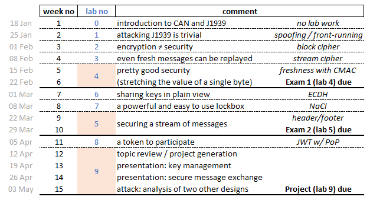

HVOC_2023
=========

Spring 2023 Iowa State University Ag Engr 590 Course on "Hacking Vehicle
On-board Communications"

.. important::

	`Welcome & Setup <docs/welcome.rst>`_

Use
---

Each week students pull the most recent lab content by executing::

	$ git pull

Schedule
--------

Resources
---------

Below are various resources that will be useful during the semester.

Getting Started
...............

#. J1939 Data from Colorado State: https://www.engr.colostate.edu/~jdaily/J1939/candata.html

#. How to Setup a Virtual CAN Interface: https://www.youtube.com/watch?v=iUgaoTJiO70

#. CAN FD Support in Virtual CAN (vcan) in SocketCAN: https://stackoverflow.com/questions/36568167/can-fd-support-for-virtual-can-vcan-on-socketcan

#. [advanced] Using C with SocketCAN: https://www.can-cia.org/fileadmin/resources/documents/proceedings/2012_kleine-budde.pdf

Attack History
..............

#. Wired: Jeep Hack I https://www.wired.com/2015/07/hackers-remotely-kill-jeep-highway/

#. Wired: Jeep Hack II https://www.wired.com/2016/08/jeep-hackers-return-high-speed-steering-acceleration-hacks/

#. Wired: Univ of Mich Grad Students Homework: https://www.wired.com/2016/08/researchers-hack-big-rig-truck-hijack-accelerator-brakes/

#. Video of Univ of Mich Grad Students: https://www.youtube.com/watch?v=kG91j2JL7F0

#. Python supply chain issue in the news: https://www.bleepingcomputer.com/news/security/pytorch-discloses-malicious-dependency-chain-compromise-over-holidays/

#. Sam Curry:  attacking multiple OEM fleets via telematics. https://twitter.com/samwcyo/status/1597792097175674880 

#. Sam Curry: another attack (03 JAN 2023) https://samcurry.net/web-hackers-vs-the-auto-industry/

#. VM reused 'master' keys for 20 years: https://www.theregister.com/2016/08/11/car_lock_hack/

#. [attack?] Internet search: tractor engine tuner.

Defense
.......

#. NHTSA "Cybersecurity Best Practices for the Safety of Modern Vehicles": https://www.nhtsa.gov/sites/nhtsa.gov/files/2022-09/cybersecurity-best-practices-safety-modern-vehicles-2022-tag.pdf

Books
.....

*If you want to buy a book(s) for the course*

#. "Serious Cryptography", Jean-Philippe Aumasson. No Starch Press. ISBN-13 978-1593278267.

#. "The Car Hacker's Handbook", Craig Smith. No Starch Press. ISBN-13 978-1593277031.
 
----

*Really good textbooks*

#. "Understanding Cryptography", Christof Paar. Springer. ISBN-13 978-3642041006.

#. "Cryptography Engineering", Niels Ferguson, Bruce Schneier, Tadayoshi Kohno. Wiley. ISBN-13 978-0470474242.

#. "Security Engineering", Ross Anderson. Wiley. ISBN-13 978-1119642787.

----

*Popular press*

#. "The Code Book", Simon Singh. Anchor. ISBN-13 978-0385495325.

Papers
......

See 'papers' directory 

Advanced
........

#. Working with OpenECU: https://pisnoop.s3.amazonaws.com/snoop_help_getting_started.htm

