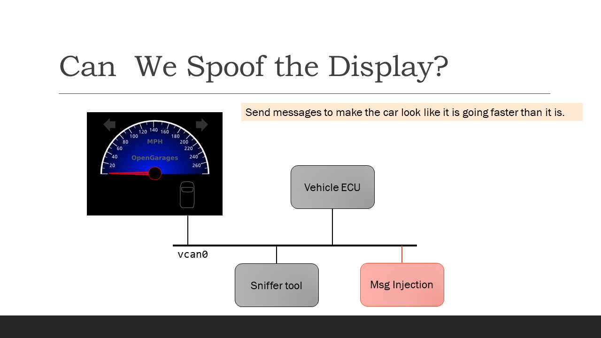

Welcome
=======

Overview
--------

	The network provided by ICSim along with one kind of attack.

The video shows setting up and using ICSim. 

Perhaps you prefer reading... here is a summary I created.
`Virtual Network Introduction <Virtual_Network_Introduction.pdf>`_

Video
.....
Watch this video on car hacking simulation environment, "ICSim", that inspired our lab.

ICSim -- Rising Tide Cybersecurity "Introducing CAN and ICSim" `video <https://www.youtube.com/watch?v=CxS-S91DWxY>_`

1:18 -- CAN
3:00 -- Linux support of 'can' / 'vcan'
3:30 -- can-utils

<can skip the install of ICSim... your VM already has what you need>

Week 1 Setup
------------

busy, busy, busy
