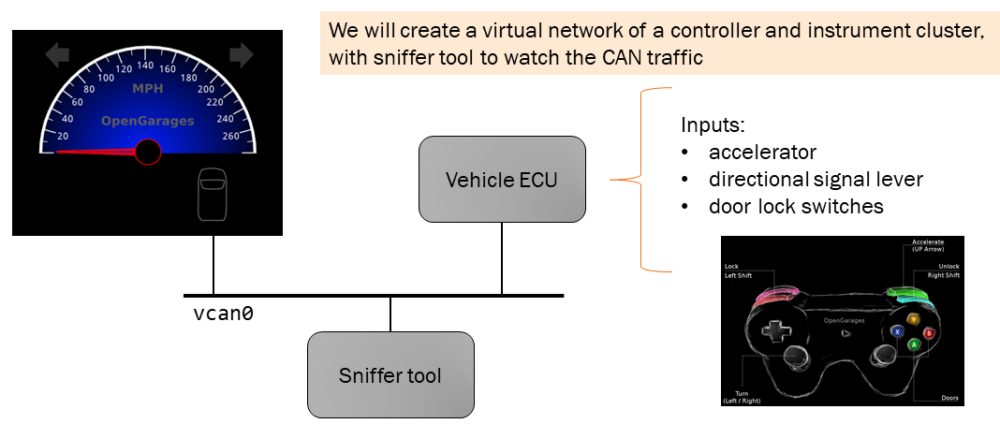

Welcome
=======

HVOC -- Hacking Vehicle On-board Communications

* This semester you will use a simulated SAE J1939 vehicle network to
  demonstrate methods to protect and attack messages sent between vehicle controllers.

* You will use a virtual machine (VM) use as your lab bench.

* The VM is for your individual use.

* The VM is already configured for simulating CANBUS.

* You will write or edit (small) python scripts:

  * sometimes to provide and/or validate security of your design.
  * sometimes to attack a security scheme provided by the instructor.

* During the semester, you will see the techniques you learned applied
  to two *proposals* for international standards relevant to securing vehicle on-board
  communications used in agricultural equipment.

Login Before First Class
------------------------

Please log into your VM *before* the first day of class.

* You will receive an invitation to your VM via email

* Use these `instructions <AzureSetup.rst>`_ to get started.

  * Note: you will install an X-window client. 

Overview/Lab Inspiration
------------------------

Our (Truck, Bus, Ag, i.e., SAE J1939) lab environment was inspired by the
automotive simulator, "ICSim" (IC means "instrument cluster"). The video link below shows
setting up and using ICSim.  

    The network provided by ICSim. The game controller (or keyboard) is used to
    provide automotive signals on the virtual CAN bus ('vcan0'). The instrument
    cluster reads CAN messages, extracts the signal, converts to engineering units
    and then displays the results on the simulated instrument cluster.

Video
.....

ICSim -- Rising Tide Cybersecurity "Introducing CAN and ICSim" `video <https://www.youtube.com/watch?v=CxS-S91DWxY>`_

* 1:18 -- CAN
* 3:00 -- Linux support of 'can' / 'vcan'
* 3:30 -- can-utils

* <can skip the install of ICSim... your VM already has what you need>

* 7:58 -- the executables ('icsim' and 'controls')
* 9:10 -- launching
* 10:10 -- driving the car (see the instrument cluster updates)
* 12:30 -- cansniffer
* 14:30 -- candump
* 15:30 -- cansend
 
Perhaps you prefer reading... here is a summary I created.  `Virtual Network Introduction <Virtual_Network_Introduction.pdf>`_
